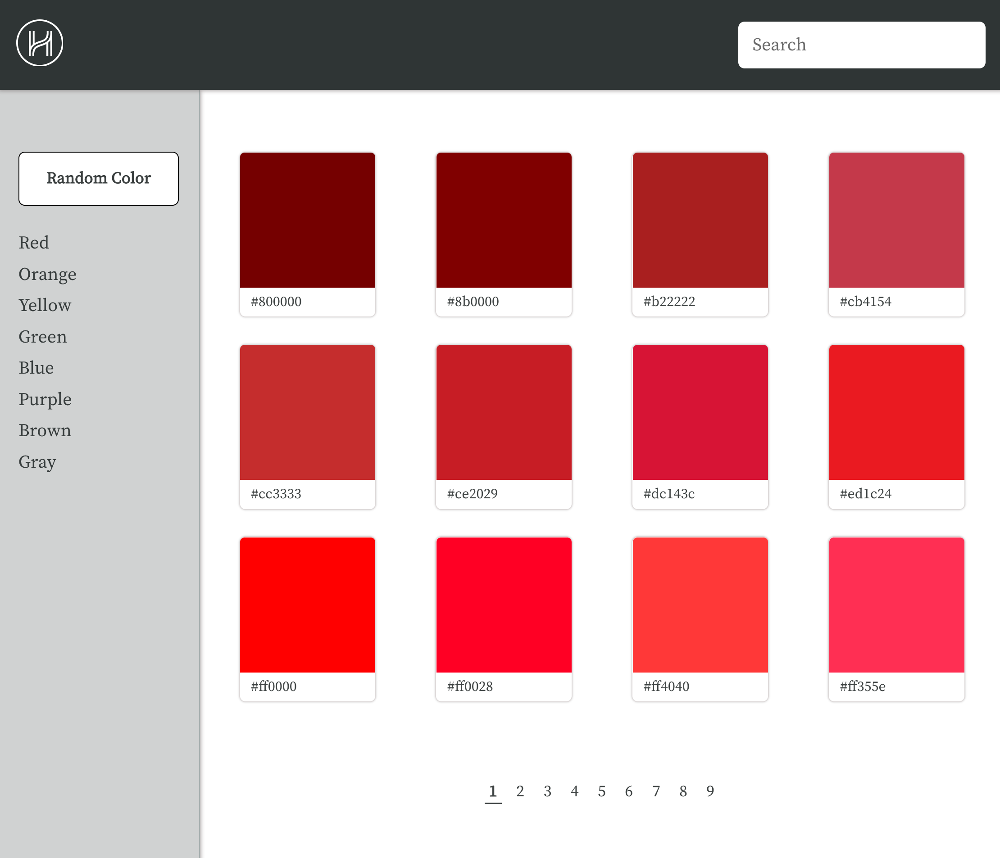
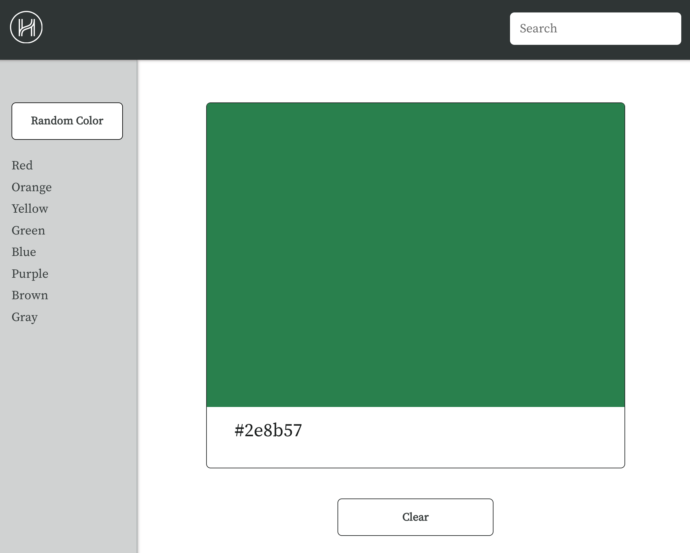

# Color Swatches
## Date: 3/15/2022
### By: Benjamin Peck
#### [GitHub](https://github.com/benjaminobambino) | [LinkedIn](https://www.linkedin.com/in/benjaminlpeck/)
***
### ***Description***
#### ***Color Swatches*** is a full-stack project made following prompts and design samples provided by [Helpful Human](https://www.helpfulhuman.com/). Whether I have the honor of joining their team or not, it has been a pleasure to speak with them and create this project.
#### For the sake of following instructions thoroughly, not all features have been implemented at this time. For example, the search bar and side menu functionality are ready to be implemented, but have not been because other features are prioritized in the provided stretch goals (see &ldquo;Future Updates&rdquo; below).
#### The instuctions and prompt info can be found in the prompt folder [README](prompt/README.md) of this repo.
#### The initial planning phase [ERD](diagrams/erd.png) and [component hierarchy diagram](diagrams/component-hierarchy-diagram.png) can be found in the diagrams folder of this repo.
***
### ***Deliverables***
#### Cobebase in this repo.
#### [The deployed app.](https://colorswatches.netlify.app/)
#### This: ヽ༼ ◉  ͜  ◉༽ﾉ
***
### ***Technologies Used***
* PostgreSQL
* Python
* Django
* React
  * React Router
    * React Router Hooks API 
  * React Hooks API
  * Custom Hooks
* JavaScript
* Axios
* CSS
  * Flexbox
* HTML
***
### ***Getting Started***
#### The project backend REST API has been deployed on Heroku with the frontend on [Netlify](https://colorswatches.netlify.app/).
#### Simply visit [the deployed app](https://colorswatches.netlify.app/) and take a colorful look around.
***
### ***Screenshots***
#### List View

#### Detail View

***
### ***Future Updates***
- [x] Responsive design
- [ ] Hamburger menu for mobile
- [ ] Refactored pagination
- [ ] Generate codes and colors from script
- [ ] Search bar Function
- [ ] Color shades in Detail View
- [ ] Clickable sidebar menu
***
### ***Resources***

##### Acedemind: [Pagination Resource](https://academind.com/tutorials/reactjs-pagination)